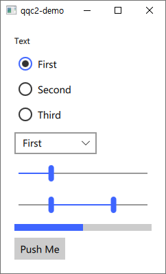

# Qt Quick Controls 2 with CMake



A template project shows how to build a Qt Quick Controls 2 project using CMake.

## Build

Set `CMAKE_PREFIX_PATH` to the install prefix of Qt 6. e.g. `\Qt\6.1.0\msvc2019_64` on Windows.

```
cmake -B _build -DCMAKE_PREFIX_PATH="<Qt-Install-Prefix>"
cmake --build _build
```

And run `.\_build\qqc2-demo\Debug\qqc2-demo.exe`
